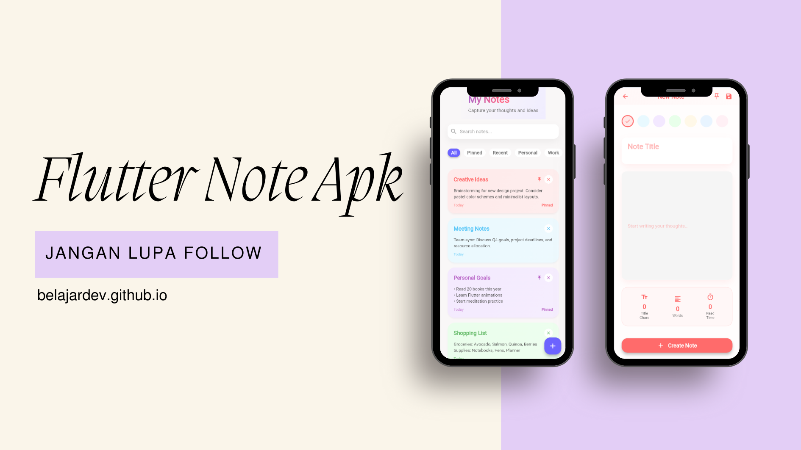

# 📝 Flutter Notes App

<p align="center">
  
</p>

Flutter Notes App adalah aplikasi catatan sederhana yang dibuat menggunakan Flutter dengan tampilan **modern dan aesthetic**.  
Aplikasi ini mendukung fitur **CRUD (Create, Read, Update, Delete)** dan cocok untuk latihan serta portfolio GitHub.

---

## ✨ Fitur

- ➕ Tambah catatan
- ✏️ Edit & update catatan
- 🗑️ Hapus catatan (dengan konfirmasi)
- 🎨 UI modern & clean
- 📱 Responsive

---

## 🚀 Cara Menjalankan

```bash
flutter pub get
flutter run
```

## 🛠️ Tech Stack

- Flutter
- Dart
- Material 3

---

## 👨‍💻 Developer

**BelajarDev**
[https://github.com/BelajarDev](https://github.com/BelajarDev)
```
